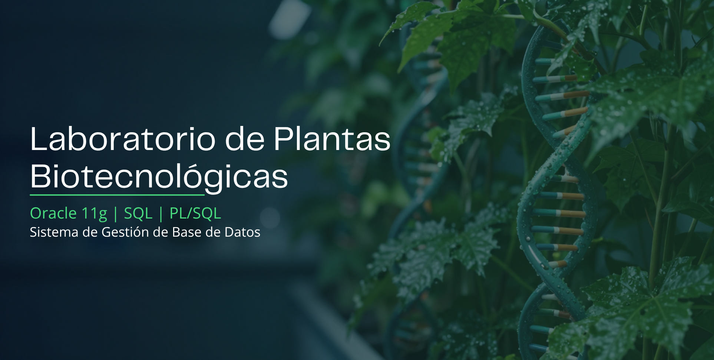
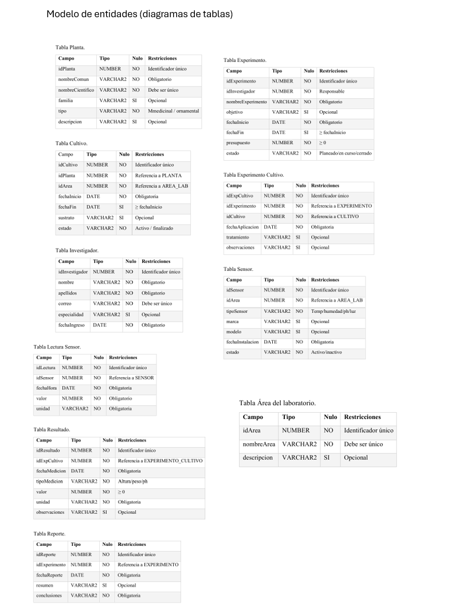
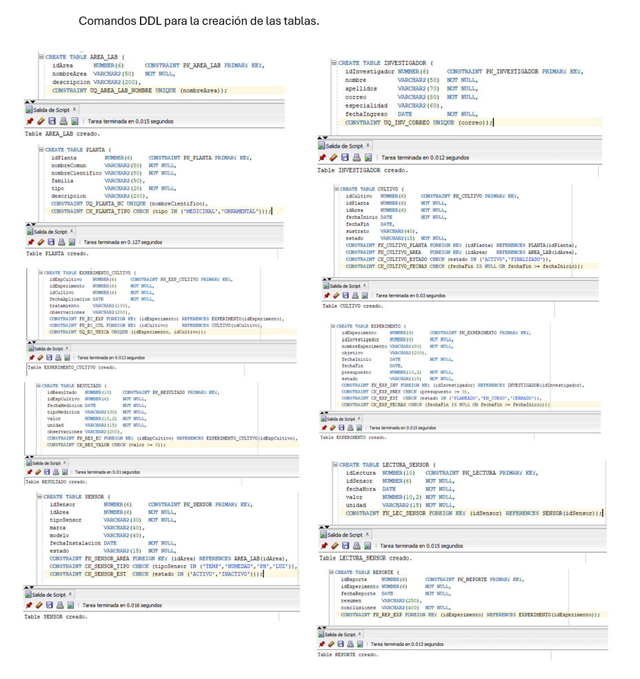
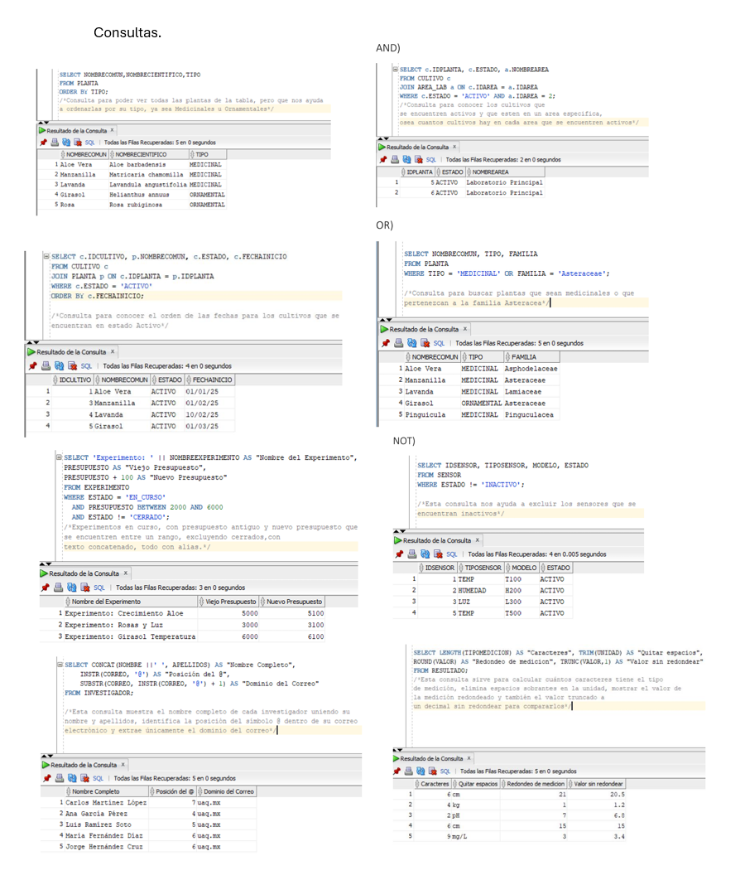
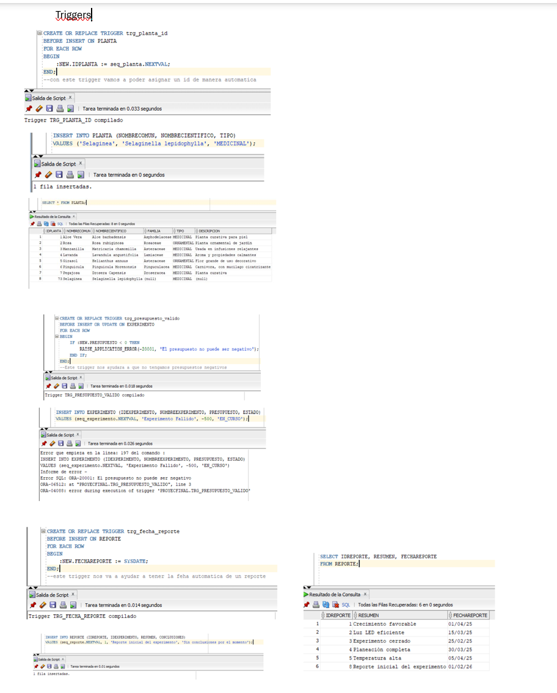

<p align="center">
  
</p>

# Laboratorio de Plantas Biotecnológicas

Proyecto desarrollado como parte del Diplomado Oracle 11g de la Universidad Autónoma de Querétaro.

## Descripción

Sistema de gestión para un laboratorio de biotecnología vegetal enfocado en el control de cultivos, 
experimentos, investigadores, sensores ambientales y reportes científicos.

El proyecto implementa una base de datos relacional completa utilizando Oracle Database 11g y PL/SQL 
para automatizar procesos y asegurar la integridad de los datos.

---

## Tecnologías Utilizadas

- Oracle Database 11g
- SQL
- PL/SQL
- Oracle SQL Developer

---

## Funcionalidades

- Gestión de plantas medicinales y ornamentales.
- Administración de cultivos e invernaderos.
- Registro de investigadores.
- Gestión de experimentos.
- Captura de lecturas de sensores.
- Generación de reportes científicos.
- Automatización mediante procedimientos y triggers.

---

## Estructura del Proyecto

```text
laboratorio-biotecnologico-oracle
│
│
├── docs/
│   └── proyecto-final-oracle11g.pdf
│
├── screenshots/
│
├── sql/
│   └── ProyectoFinal.sql
│
├── README.md
└── LICENSE
```
---

##  Modelo Entidad-Relación



---

##  Diseño de Tablas



---

##  Consultas SQL



---

##  Triggers y Automatización



---
## Componentes Implementados

- Diseño de Base de Datos Relacional
- Llaves Primarias y Foráneas
- Restricciones CHECK
- Consultas SQL Avanzadas
- JOINs y Subconsultas
- Views
- Sequences
- Synonyms
- Gestión de Usuarios y Privilegios
- Cursores
- Procedimientos Almacenados
- Funciones
- Triggers

---

## Aprendizajes

Durante este proyecto reforcé conocimientos sobre diseño de bases de datos, modelado relacional, SQL avanzado,
PL/SQL y automatización de procesos dentro de Oracle Database.

---

## Autor

Francisco Javier Cordoba Tufiño

Estudiante de Ingeniería de Software  
Universidad Autónoma de Querétaro
